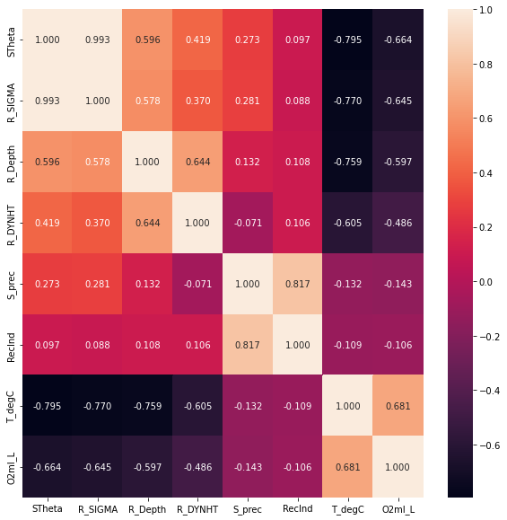
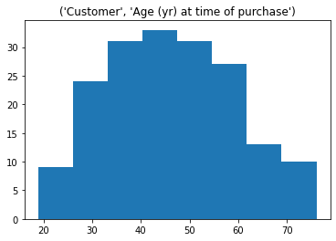
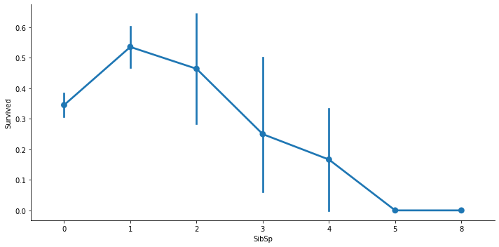

# [Oceanographic data analysis](https://github.com/richardmfitumukiza/california-oceanographic-data/blob/main/machine_learning_engineering.ipynb)

* abcd efg
* abcd efg
* abcd efg

# [Marketing data analysis](https://github.com/richardmfitumukiza/real-estate-marketing-analytics/blob/main/Descriptive_statistics.ipynb)

* abcd efg
* abcd efg
* abcd efg

# [Titanic data analysis](https://github.com/richardmfitumukiza/Titanic-dataset/blob/main/Machine_Learning_Engineering.ipynb)

* abcd efg
* abcd efg
* abcd efg
